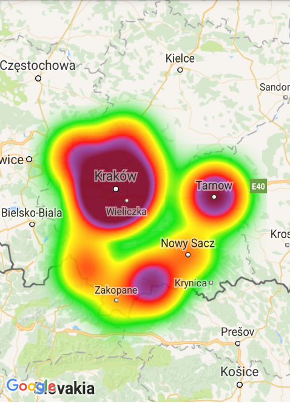
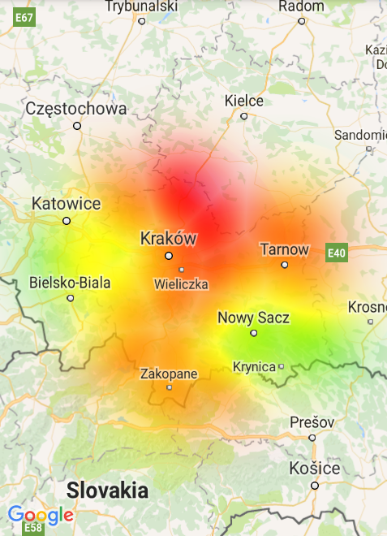
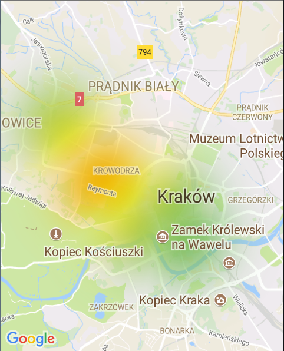
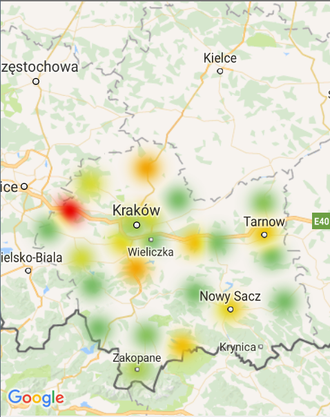
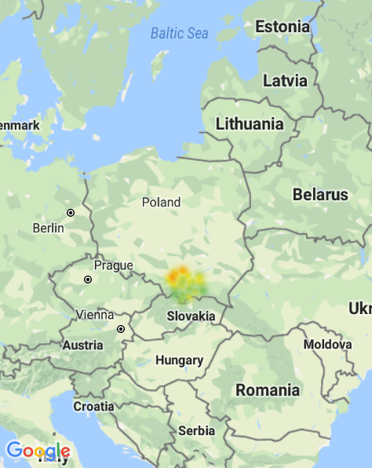

# react-native-heatmaps

This is an instruction on how to use my fork of [react-native-maps](https://github.com/react-community/react-native-maps) which adds possibility to draw heatmaps (**but only for Google Maps**).

There are 2 different types of heatmaps implemented - density based and weight based. The first one is drawn with Google algorithm from their Maps Utils ([Android](https://developers.google.com/maps/documentation/android-api/utility/heatmap) and [iOS](https://developers.google.com/maps/documentation/ios-sdk/utility/heatmap)). The second one is based on my own algorithm.

Screens below are example heatmaps for the same dataset but drawn with these two different algorithms.

<p align="center">
  
  
</p>


## Installation
Complete installation instruction for [react-native-maps](https://github.com/pjamrozowicz/react-native-maps/blob/master/docs/installation.md) with small change - download `react-native-maps` from:
```
npm install git+https://github.com/pjamrozowicz/react-native-maps.git --save
```
And then continue with installation for each platform:

### Android

In your `android/build.gradle` add:

```
flatDir {
    dirs "$rootDir/../node_modules/react-native-maps/libs"
}
```

It should look like this:
```
allprojects {
    repositories {
        mavenLocal()
        jcenter()
        maven {
            // All of React Native (JS, Obj-C sources, Android binaries) is installed from npm
            url "$rootDir/../node_modules/react-native/android"
        }
        flatDir {
            dirs "$rootDir/../node_modules/react-native-maps/libs"
        }
    }
}
```

### iOS
In your `ios/Podfile` add line below and don't forget to run `pod install`:

```
pod 'Google-Maps-iOS-Utils', :git => 'https://github.com/pjamrozowicz/google-maps-ios-utils.git'
```

Remember to use `PROVIDER_GOOGLE` as `MapView` provider (check the example below). 
For some reason, weight based heatmap is not displayed correctly when testing on simulator.

## Component API
Prop | Type | Default | Note 
------------ | ------------- | ------------- | -------------
`heatmapMode` | oneOf `POINTS_DENSITY`, `POINTS_WEIGHT` | `POINTS_DENSITY` | Algorith used to draw heatmap.
`points` | `Array<{latitude: Number, longitude: Number, weight: Number}>` | | Array of points for which the heatmap will be drawn. In density based algorithm, weight means number of points in a given place.
`opacity` | `Number` | `0.7` | Opacity of the heatmap.
`radius` | `Number` | `10` | The radius of area around the point for which the heatmap should be drawn.
`onZoomRadiusChange` | `{zoom: Array<Number>, radius: Array<Number>}` | | Alternative to `radius` which lets you change it when map zoom changes. `zoom` and `radius` arrays should have equal sizes. When you set for example `onZoomRadiusChange={{zoom: [0, 17], radius: [10, 250]}}`, radius will be interpolated from `10` to `250` for zoom between `0` and `17`. For zoom `>17` the value will stay at `250`. If you set it, you don't need to use `radius` prop. <br/><br/>**Only for Android and `POINTS_WEIGHT` heatmap mode.**
`gradient` | `{colors: Array<String>, values: Array<Number>}` | `{colors: ["#00E400", "#FF0000"], values: [0.2, 1.0]}` | Customize color for the heatmap. <br/>`colors` and `values` arrays should have equal sizes. Pass colors as hex strings (like in the example). <br/> Values array should include numbers less or equal `1.0`. <br/>How does it work - when you define `gradient` like in the example, it means that heatmap will be colored starting from color `"#00E400"` for values bigger than `20%` (0.2) of the maximum value up to color `"#FF0000"` for the maximum value. Values between will get color interpolated between these two colors. If may aswell start coloring from `0` and have all values colored.<br/>
`maxIntensity` | Number | 0 | When you set to number bigger than `0`, heatmap will be colored with regard to this value as the maximum value, not the maxmium value in the dataset.<br/><br/>**Only for `POINTS_WEIGHT` heatmap mode.**
`gradientSmoothing` | Number | 10 | When set, color of the heatmap around a point will change linearly up to the given value. For example, when you use all default settings, maximum color is red. Without this setting point that has maximum value will be drawn with red color as well as circle around it. With this value set, color of the circle will change linearly to 'lower' color.<br/><br/>**Only for `POINTS_WEIGHT` heatmap mode.**

## Example

```
import React, { Component } from 'react';
import {
  Platform,
  StyleSheet,
  View
} from 'react-native';
import MapView, { PROVIDER_GOOGLE } from 'react-native-maps';

export default class App extends Component<{}> {
  render() {
	let points = [
		{latitude:49.986111, longitude:20.061667, weight: 1},
		{latitude:50.193139, longitude:20.288717, weight: 2},
		{latitude:49.740278, longitude:19.588611, weight: 1},
		{latitude:50.061389, longitude:19.938333, weight: 8},
		{latitude:50.174722, longitude:20.986389, weight: 11},
		{latitude:50.064507, longitude:19.920777, weight: 98},
		{latitude:49.3, longitude:19.95, weight: 41},
		{latitude:49.833333, longitude:19.940556, weight: 66},
		{latitude:49.477778, longitude:20.03, weight: 9},
		{latitude:49.975, longitude:19.828333, weight: 11},
		{latitude:50.357778, longitude:20.0325, weight: 33},
		{latitude:50.0125, longitude:20.988333, weight: 76},
		{latitude:50.067959, longitude:19.91266, weight: 63},
		{latitude:49.418588, longitude:20.323788, weight: 52},
		{latitude:49.62113, longitude:20.710777, weight: 88},
		{latitude:50.039167, longitude:19.220833, weight: 1},
		{latitude:49.970495, longitude:19.837214, weight: 78},
		{latitude:49.701667, longitude:20.425556, weight: 1},
		{latitude:50.078429, longitude:20.050861, weight: 1},
		{latitude:49.895, longitude:21.054167, weight: 1},
		{latitude:50.27722, longitude:19.569658, weight: 65},
		{latitude:49.968889, longitude:20.606389, weight: 1},
		{latitude:49.51232, longitude:19.63755, weight: 1},
		{latitude:50.018077, longitude:20.989849, weight: 35},
		{latitude:50.081698, longitude:19.895629, weight: 22},
		{latitude:49.968889, longitude:20.43, weight: 54},
		{latitude:50.279167, longitude:19.559722, weight: 1},
		{latitude:50.067947, longitude:19.912865, weight: 69},
		{latitude:49.654444, longitude:21.159167, weight: 1},
		{latitude:50.099606, longitude:20.016707, weight: 80},
		{latitude:50.357778, longitude:20.0325, weight: 99},
		{latitude:49.296628, longitude:19.959694, weight: 1},
		{latitude:50.019014, longitude:21.002474, weight: 46},
		{latitude:50.056829, longitude:19.926414, weight: 22},
		{latitude:49.616667, longitude:20.7, weight: 1},
		{latitude:49.883333, longitude:19.5, weight: 33},
		{latitude:50.054217, longitude:19.943289, weight: 1},
		{latitude:50.133333, longitude:19.4, weight: 100}
	];
    return (
      <View style ={styles.container}>
        <MapView
	  provider={PROVIDER_GOOGLE}
          style={styles.map}
          region={{
            latitude: 50.0614300,
            longitude: 19.9365800,
            latitudeDelta: 0.09,
            longitudeDelta: 0.0121
          }}
        >
        
        <MapView.Heatmap points={points}
                         opacity={1}
                         onZoomRadiusChange={{
                             zoom: [0, 3, 4, 5, 6, 9, 10, 11, 12, 13, 14, 15, 16, 17],
                             radius: [10, 10, 15, 20, 30, 60, 80, 100, 120, 150, 180, 200, 250, 250]
                          }}
                         gradient={{
                             colors: ["#79BC6A", "#BBCF4C", "#EEC20B", "#F29305", "#E50000"],
                             values: [0, 0.25, 0.50, 0.75, 1]}}
                         maxIntensity={100}
                         gradientSmoothing={10}
                         heatmapMode={"POINTS_WEIGHT"}/>		 
        </MapView>
      </View>
    );
  }
}

const styles = StyleSheet.create({
  container: {
    ...StyleSheet.absoluteFillObject,
    height: 400,
    width: 400,
    justifyContent: 'flex-end',
    alignItems: 'center',
  },
  map: {
    ...StyleSheet.absoluteFillObject,
  },
});
```

Result:

<p align="center">
  
  
  
</p>

## Todos
* Fix handling points which are near the map edge in weight based algorithm.
* Add possibility to change radius when zooming in iOS for weight based algorithm.
* Add points aggregation to weight based algorithm so that it works much faster for many points.
* Get rid of apache-commons and write interpolation function myself maybe? Because you might be required to include `multiDexEnabled true` in your `android/app/build.gradle` if you have many dependencies.
* Coloring for density based heatmap on iOS is a bit broken.
* Remove unnecessary default values.
